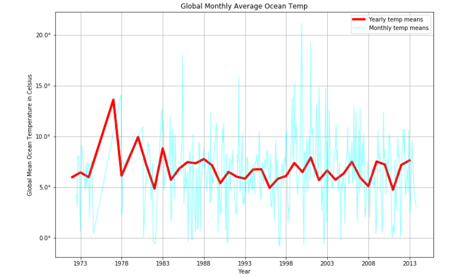

# NOAA Climate Investigation

## EDA and Modelling

Let's take a look at data from the GLODAPv2 Oceanic dataset. This is a large dataset of 100 columns and almost a million rows, covering a span of four decades between 1973 and 2013, consisting of station oceanic feature measurements from around the globe. My initial interest in this data was driven by my interest in climate change, and ocean temperatures as a proxy for global warming. To that extent I will be looking for strong predictors of global mean oceanic temperature deltas, and attempting to produce predictive models based on our feature set.

## Summary Graph of Temperature Data:

